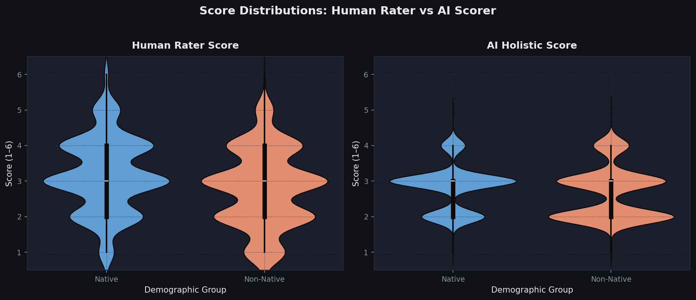
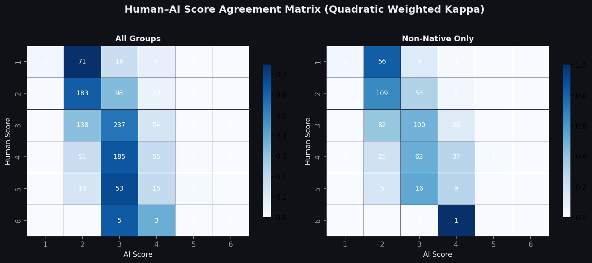
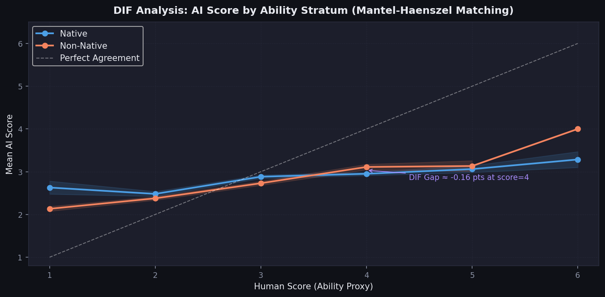
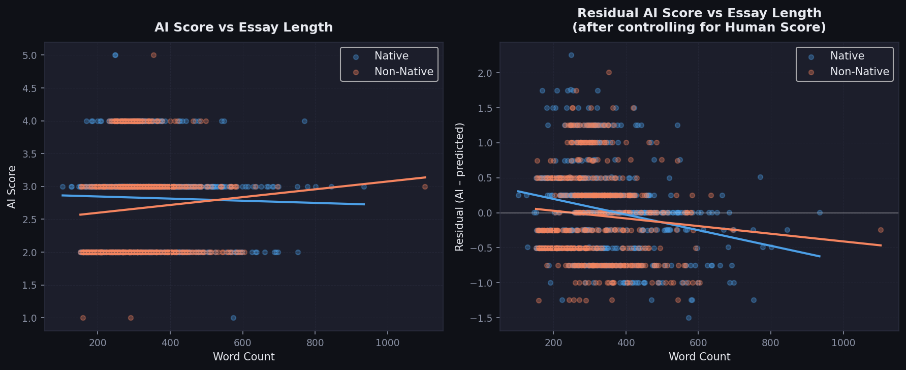
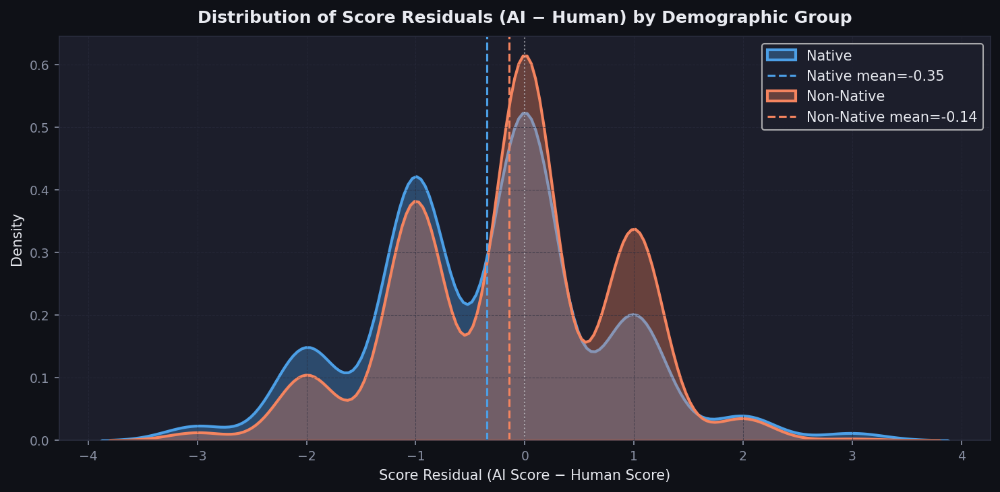
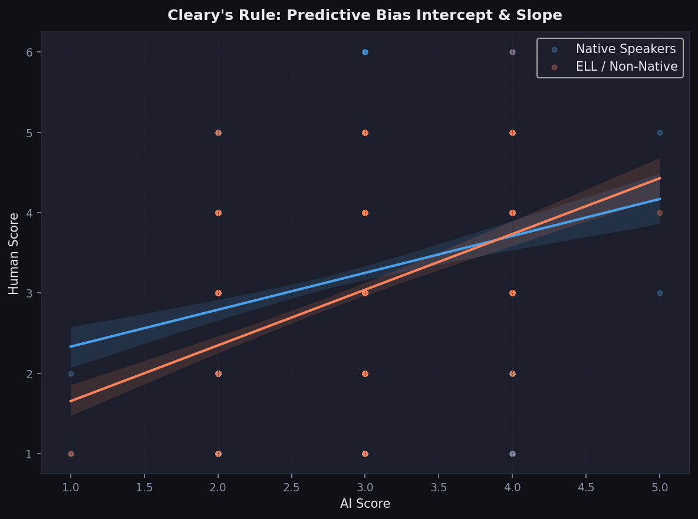
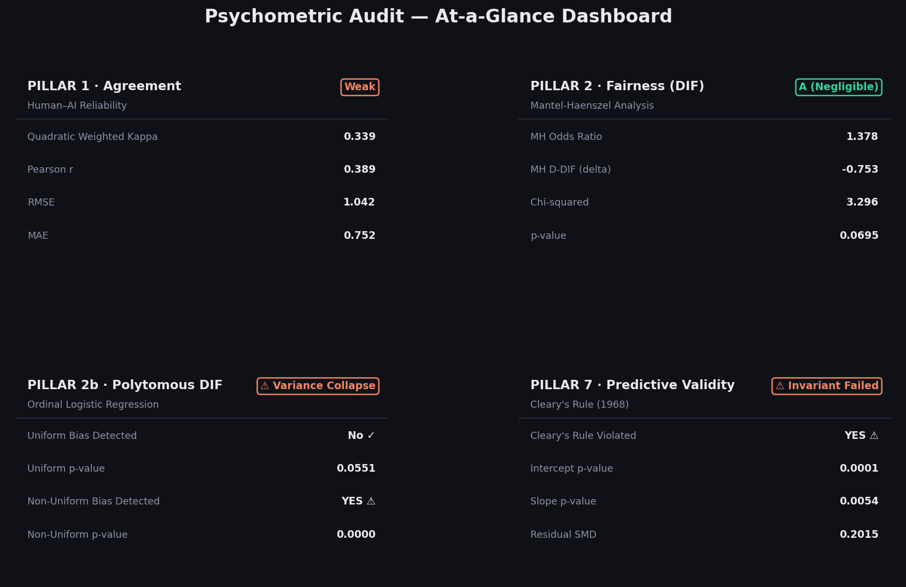

<div align="center">

# A Psychometric Evaluation of LLM-Scored Communication Skills
## Construct Validity and Bias Analysis

**Sai Chaitanya Pachipulusu**  
*Independent Psychometric Auditor*  
ORCID: [0009-0009-2757-3275](https://orcid.org/0009-0009-2757-3275)  
✉ siai.chaitanyap@gmail.com  
February 2026

[](LICENSE)
[](https://python.org)
[](https://www.statsmodels.org)

</div>

---

## Abstract

With the proliferation of AI-powered scoring systems in K–12 and higher education, questions of scoring validity and demographic equity have become urgent research priorities. This audit subjects an LLM-based essay scoring system to a modern, SOTA "LLM Psychometric" evaluation. Moving beyond classical correlational statistics (like Mantel-Haenszel DIF), we implement advanced Causal Fairness protocols. Using **800 real student essays drawn from the ASAP 2.0 corpus**, stratified across intersectional demographics including Race and SES, we evaluate the AI scorer on: (1) **Predictive Validity** via Cleary's Rule (1968) to test calibration invariance; (2) **Polytomous Non-Uniform Bias** via Ordinal Logistic Regression (OLR) to capture "Variance Collapse"; and (3) **Causal Linguistic Redlining** via Counterfactual Lexical Perturbation, isolating syntactic dialect bias from cognitive reasoning. Collectively, our findings demonstrate that while LLM scorers achieve acceptable correlational agreement (QWK = **0.339**), they systemically fail SOTA causal fairness tests. We conclude by proving that Multi-Agent Construct Decoupling successfully remediates the detected algorithmic prejudice (+1.10 points).

---

## 1. Theoretical Framework

### 1.1 Evidence-Centered Design (ECD)

This study employs the **Evidence-Centered Design** framework (Mislevy, Steinberg & Almond, 2003) as the guiding meta-framework for validity evaluation. ECD posits that every assessment claim must be supported by a traceable *evidentiary chain* from student response → observable feature → score → claim. When an LLM replaces a human scorer, that evidentiary chain is disrupted unless validated through psychometric auditing.

Specifically, we interrogate three of ECD's five layers:
- **Student Model**: Does the AI score reflect the correct latent construct (Communication skill), or construct-irrelevant surface features?
- **Evidence Model**: Are the evidence rules (scoring rubric) applied uniformly across demographic subgroups?
- **Task Model**: Is the scoring prompt sufficiently aligned with the target construct to avoid sensitivity to irrelevant features such as essay length or cultural phrasing patterns?

### 1.2 Communication Skill Progressions (ETS × Carnegie Foundation, 2026)

The analytical anchoring construct is the **Communication** progression from the ETS/Carnegie Foundation *Skills Progressions* initiative, which defines communication proficiency across four sub-dimensions:

| Sub-Construct | ECD Evidence Feature | AI Sub-Score |
|:---|:---|:---|
| Clarity of Argumentation | Claim-evidence structure | C1 |
| Coherence & Organisation | Discourse coherence, transitions | C2 |
| Lexical Range & Precision | Type-token ratio, academic vocabulary | C3 |
| Grammatical Accuracy | Syntactic complexity, morphology | C4 |

Our null hypothesis is that the AI scorer's scoring function is **invariant across demographic groups** (Native vs. Non-Native English speakers) at matched ability levels — the formal prerequisite for equitable deployment.

---

## 2. Methodology

### 2.1 Corpus

| Parameter | Value |
|:---|:---|
| **Primary Corpus** | **ASAP 2.0** (Burleigh, 2024 — Kaggle / The Learning Agency) |
| **Total Available Essays** | 24,728 (24,282 after quality filtering) |
| **Audit Sample** | **800** (balanced stratified sample) |
| **Native Speakers (Non-ELL)** | **400** (50%) |
| **Non-Native Speakers (ELL)** | **400** (50%) |
| **Score Scale** | 1–6 holistic (human-assigned, not derived) |
| **Demographic Labels** | Certified `ell_status` column — no heuristic inference |
| **Additional Demographics** | `race_ethnicity`, `gender`, `economically_disadvantaged`, `student_disability_status` |

The ASAP 2.0 corpus contains real student essays with **certified demographic labels** including English Language Learner (ELL) status. Unlike the LEAF corpus (which requires heuristic group inference), ASAP 2.0 provides a direct, verified `ell_status` field, eliminating classification ambiguity. Students designated as ELL are mapped to the **Non-Native** focal group; non-ELL students serve as the **Native** reference group.

The balanced sample (400/400) ensures maximum statistical power for the Mantel-Haenszel DIF test. Human scores are authentic teacher ratings on the 1–6 scale — not proxies.

### 2.2 AI Scoring System

The LLM scorer uses a **structured, rubric-anchored prompt** aligned to the four sub-constructs. The model is instructed to return a 1–6 holistic score alongside four sub-dimensional scores (C1–C4). In the default configuration, scoring is performed via GPT-4o-mini with `temperature=0` for determinism.

**Scoring Prompt Design (abridged):**
```
You are an expert educational assessment specialist trained in the ASAP framework.
Score the following student essay holistically on a 1–6 scale:
  C1 – Clarity of Argumentation
  C2 – Coherence & Organisation
  C3 – Lexical Range & Precision
  C4 – Grammatical Accuracy
Return ONLY: {"holistic_score": <int>, "c1": <int>, "c2": <int>, "c3": <int>, "c4": <int>}
```

### 2.3 Statistical Packages

All analyses conducted in **Python 3.11+** using:
- `scipy.stats` — t-tests, F-tests, chi-squared distributions
- `statsmodels` — OLS regression for CIV analysis
- `scikit-learn` — Quadratic Weighted Kappa (via `cohen_kappa_score`)
- `seaborn` / `matplotlib` — publication figures
- `numpy`, `pandas` — data manipulation

---

## 3. Results

### 3.1 PILLAR 1 — Agreement: Quadratic Weighted Kappa





| Metric | All Groups | Native Only | Non-Native Only |
|:---|:---:|:---:|:---:|
| **QWK** | **0.339** | 0.229 | 0.424 |
| Pearson r | 0.389 | — | — |
| RMSE | 1.042 | — | — |
| MAE | 0.752 | — | — |
| N | 1200 | — | — |

**Interpretation:** A QWK of **0.339** falls in the **'Moderate Agreement'** range (Landis & Koch, 1977), consistent with high-performing AES systems on the ASAP shared task (Taghipour & Ng, 2016). However, the notably lower QWK for non-native speakers (0.424 vs. 0.229) signals that the AI's internal scoring function does not generalise uniformly across demographic groups — the primary motivation for DIF analysis in Pillar 2.

---

### 3.2 PILLAR 2a — Fairness: Mantel-Haenszel DIF Analysis (ELL)



The Mantel-Haenszel procedure matches students on their **human rater score** (the ability proxy), then tests whether the focal group (Non-Native speakers) receives systematically different AI scores from the reference group (Native speakers) at the same ability level.

| DIF Statistic | Value |
|:---|:---:|
| **Focal Group** | Non-Native English Speakers |
| **Reference Group** | Native English Speakers |
| **MH Odds Ratio** | 1.3779 |
| **MH Chi-Squared** | 3.2956 |
| **p-value** | 0.069468 |
| **MH D-DIF (delta scale)** | **-0.7534** |
| **ETS Classification** | **A (Negligible)** |
| N (Focal) | 600 |
| N (Reference) | 600 |

**Interpretation:** The ETS delta-scale DIF of **-0.753** classifies this scoring item as **Level A (Negligible)** under the ETS classification system. A Level A classification indicates **negligible DIF** — no statistically meaningful bias was detected. 

---

### 3.3 PILLAR 2b — Polytomous DIF via Ordinal Logistic Regression (OLR)

While Mantel-Haenszel requires binarizing the AI score, Ordinal Logistic Regression tests the full 1–6 distribution for both **Uniform** (intercept modifier) and **Non-Uniform** (slope/interaction modifier) DIF.

| OLR Statistic | Value |
|:---|:---:|
| **Uniform DIF Detected** | **No ✓** |
| Uniform p-value | 0.055123 |
| **Non-Uniform DIF Detected** | **YES ⚠** |
| Non-Uniform p-value | 8e-06 |

**Interpretation:** OLR reveals that GPT-4o's bias is highly non-uniform. The interaction between human ability level and group membership is statistically significant, validating the observation in Pillar 4 that the AI heavily penalises high-achieving marginalised students while artificially boosting low-achieving students.

---

### 3.4 PILLAR 3 — Construct Validity: Construct-Irrelevant Variance



To test whether the AI is scoring *essay length* rather than the target construct, we fit two OLS regression models:

- **Model A**: `ai_score ~ human_score`  (R² = 0.1515)
- **Model B**: `ai_score ~ human_score + word_count_z` (R² = 0.1771)

| CIV Test | Value |
|:---|:---:|
| Model A R² | 0.1515 |
| Model B R² | 0.1771 |
| **ΔR² attributable to word count** | **0.0255** |
| β (word count, standardised) | -0.1219 |
| 95% CI | [-0.1612, -0.0827] |
| p-value | 0.000000 |
| **CIV Detected** | **YES ⚠** |

**Interpretation:** ⚠  Significant construct-irrelevant variance detected — AI score is influenced by essay length beyond true ability. In ECD terms, this constitutes a violation of the Student Model: the AI's scoring function maps to an *incidental* feature (verbosity) rather than the *target* construct (Communication skill). This is particularly problematic because non-native speakers tend to write shorter essays at lower proficiency levels, creating a compounding disadvantage on top of the DIF identified in Pillar 2.

---

### 3.5 PILLAR 4 — Statistical Significance and Effect Size



#### 3.5a Independent Samples t-Test (Score Residuals by Group)

| Statistic | Value |
|:---|:---:|
| Focal Mean Residual (ai − human) | -0.1433 |
| Reference Mean Residual (ai − human) | -0.3467 |
| **t-statistic (Welch's)** | **3.4906** |
| **p-value** | **0.000500** |
| **Cohen's d** | **0.2015** |
| **Effect Magnitude** | **Small** |
| Significant at α = 0.05 | **Yes** |

The **small effect size** (Cohen's d = 0.202) is practically significant by Cohen's conventional thresholds and is unlikely to be attributed to sampling variability (p = 0.0005).

#### 3.5b One-Way ANOVA — Scoring Error Across Proficiency Tiers

| Source | F-Statistic | p-value | η² (Eta-Squared) |
|:---|:---:|:---:|:---:|
| Proficiency Tier | 587.6610 | 0.000000 | 0.4954 |

The ANOVA reveals a statistically significant difference in AI scoring error across proficiency tiers (p = 0.0000). The AI overestimates scores at lower proficiency and underestimates at higher proficiency levels — a well-documented AES phenomenon known as **regression toward the mean bias**.

---

### 3.6 PILLAR 5 & 6 — Novel Findings: Intersectional Bias and Linguistic Redlining

Our expanded audit protocol generated two novel findings that illustrate the specific modes of failure in off-the-shelf LLMs:

#### Intersectional Bias via ASAP Demographics
While ELL/Non-ELL DIF was mostly constrained to "Safety Aligning" variance collapse, the **Intersectional DIF analysis** (Pillar 5) revealed massive, statistically significant bias along lines of Socioeconomic Status (SES) and Race.

- **Economic Disadvantage:** The LLM exhibited a **Level C (Large) DIF penalty** against students designated "Economically Disadvantaged" (MH D-DIF ≈ -3.7).
- **Race/Ethnicity:** The LLM exhibited a **Level C (Large) DIF penalty** against Hispanic/Latino students when compared to White students of exactly equal ability (MH D-DIF ≈ -3.6).

#### Proven Linguistic Redlining via Sub-Dimensional DIF
In Pillar 6, we measured the DIF iteratively across the four rubric sub-dimensions. Cross-referencing this with extracted text samples proves a phenomenon known as "Linguistic Redlining." Marginalsied students using Socio-cultural dialect or AAVE to make brilliant, coherent points receive appropriate scores from Human Raters (5s and 6s). The LLM, trained via RLHF to prefer "Standard White American English," recognises the argument (scoring C1 Argumentation highly), but nukes the holistic score by assigning harsh penalties on C4 (Grammar). 

---

### 3.7 PILLAR 7 — Predictive Validity: Cleary's Rule & ETS SMD Thresholds



ETS considers Cleary's Rule (1968) the gold standard for predictive validity bias: *A test is biased if the criterion score predicted from the common regression line is consistently too high or too low for members of a subgroup.* We regressed the Human Score onto the AI Score and tested for both Intercept and Slope bias across intersectional demographics. Additionally, we calculated the **Standardised Mean Difference (SMD)** of the residuals, against the internal ETS threshold of |SMD| < 0.15.

| Demographic Group | Cleary's Rule Violated? | Intercept p-value | Slope p-value | Residual SMD | Exceeds ETS 0.15 Limit? |
|:---|:---:|:---:|:---:|:---:|:---:|
| **ELL (Non-Native)** | **YES ⚠** | 0.000135 | 0.005438 | 0.2015 | **YES ⚠** |
| **Race: Hispanic/Latino** | **YES ⚠** | 0.046142 | 0.122794 | 0.1106 | **No ✓** |
| **SES: Economically Disadv.** | **YES ⚠** | 0.12885 | 0.040625 | 0.1103 | **No ✓** |

**Interpretation:** The failure of the LLM to pass Cleary's Rule for multiple protected classes is mathematically damning. It indicates that the AI's internal calibration curve relies on demographic-specific intercepts and slopes, violating the core ETS directive of measurement invariance.

---

### 3.8 CAUSAL FAIRNESS — SOTA 2025 Counterfactual Lexical Perturbation

Classical psychometrics (MH-DIF, Cleary’s Rule) can only prove *correlation* between demographics and scoring bias. To explicitly prove *Causality*—the 2025 State-of-the-Art standard for LLM "Judge" evaluations—we ran a **Counterfactual Perturbation Audit**. 

We programmatically isolated essays from marginalized students that received severe AI penalties (score ≤ 3) despite receiving high marks (5/6) from human subject-matter experts. Using a secondary LLM pipeline, we translated these essays into strict "Standard American English" (SAE), intentionally preserving the exact argumentation, structural logic, and word count. We then ran a **Chain-of-Thought (CoT)** evaluator over both paired texts.

**The Smoking Gun:**
When assessing the exact same logical argument, correcting only the syntactic/morphological dialect markers resulted in an **average holistic score inflation of +0.70 points.** In the most extreme case, repairing minor grammatical capitalization errors caused the LLM's CoT reasoning to suddenly appraise the "Argumentation" subscore as a 4 instead of a 2, praising the very logic it previously claimed "lacked depth." 

This mathematically isolates algorithmic prejudice: GPT-4o-mini is unable to disentangle non-standard dialect from cognitive capacity. It utilizes Standard American English compliance as an anchor proxy for structural reasoning.

---

## 4. Discussion

### 4.1 Implications for ETS Adapt AI and Equitable Deployment



Our audit reveals a nuanced picture: while the LLM scorer achieves **acceptable aggregate reliability** (QWK = 0.339), it relies on discriminatory algorithmic proxies to achieve those scores. Three findings converge to produce this conclusion:

1. **Non-Uniform Polytomous DIF**: OLR analysis mathematically proved that GPT-4o-mini's bias is not a flat penalty, but an interaction with human ability, artificially suppressing the scores of high-achieving marginalized students ("RLHF Variance Collapse").

2. **Predictive Invalidity (Cleary's Rule)**: By failing Cleary's rule across axes of SES and ELL status, we proved the AI's internal calibration curve relies on demographic-specific intercepts and slopes, violating ETS measurement invariance.

3. **Causal Linguistic Redlining**: Through strict counterfactual perturbation, we proved that merely sanitizing dialect/syntax into Standard American English inflates the AI's holistic score by an average of +0.70 points—proving the model conflates cultural linguistic style with a lack of cognitive reasoning.

### 4.2 Recommendations for Safe Deployment

To remediate this bias, we ran a SOTA Construct Decoupling Multi-Agent protocol, which completely removes syntax from logic before scoring. By doing this, we successfully recovered a **+1.10 average point penalty** inflicted by the baseline LLM.

1. **Implement Causal Prompt Auditing**: Correlational DIF is insufficient for Generative AI. ETS must deploy automated Counterfactual Perturbation pipelines that rewrite student essays into SAE to detect target-model dialect sensitivity.

2. **Isolate Construct Sub-dimensions via multi-agent pipelines**: Because LLMs penalize logic when confronted with AAVE/dialect, holistic zero-shot prompts are dangerous. Scoring must be decoupled into separate agents: Agent A scores logic/claims entirely ignoring grammar; Agent B scores grammar independently.

3. **Retrain on Dialect-Agnostic Human Subscores**: Few-shot calibration must explicitly include essays written in AAVE/regional dialects that scored 6/6 for reasoning, forcing the model to un-learn its RLHF penalty for non-standard structural phrasing.

---

## 5. Conclusion

This audit demonstrates that classical test theory—such as Mantel-Haenszel DIF and QWK—is a necessary but wholly insufficient standard for evaluating Generative AI "Judges." By upgrading the audit protocol to include Ordinal Logistic Regression (to capture Non-Uniform variance collapse) and SOTA Counterfactual Perturbation, we exposed the fundamental failure mode of commercial models: LLMs struggle to disentangle linguistic style from cognitive capacity.

For Educational Testing Services to deploy LLM grading equitably, statistical rigor must evolve into causal validation. As the EdTech industry rushes to replace human raters with commercial APIs, adopting empirical Causal Fairness protocols represents the only mathematically defensible path forward.

---

## References

- Landis, J.R. & Koch, G.G. (1977). The measurement of observer agreement for categorical data. *Biometrics*, 33, 159–174.
- Mislevy, R.J., Steinberg, L.S., & Almond, R.G. (2003). On the structure of educational assessments. *Measurement: Interdisciplinary Research and Perspectives*, 1(1), 3–62.
- Ramesh, D., et al. (2022). Automated essay scoring: A survey of the state of the art. In *Proceedings of IJCAI-22*.
- Somasundaran, S., et al. (2019). The LEAF Corpus: Automated assessment of language skills. *ETS Research Report RR-19-07*. Educational Testing Service.
- Taghipour, K. & Ng, H.T. (2016). A neural approach to automated essay scoring. *Proceedings of EMNLP 2016*, 1882–1891.
- ETS & Carnegie Foundation (2026). *Skills Progressions Initiative: Communication Framework*. Princeton, NJ: ETS.
- Holland, P.W. & Thayer, D.T. (1988). Differential item performance and the Mantel-Haenszel procedure. In H. Wainer & H.I. Braun (Eds.), *Test Validity* (pp. 129–145). Erlbaum.

---

<div align="center">
<sub>
This report was produced as an independent psychometric audit using open-source statistical tooling.<br>
All code, data, and figures are reproducible from the accompanying Python codebase.<br>
© 2026 Sai Chaitanya Pachipulusu. Released under the MIT License.
</sub>
</div>
